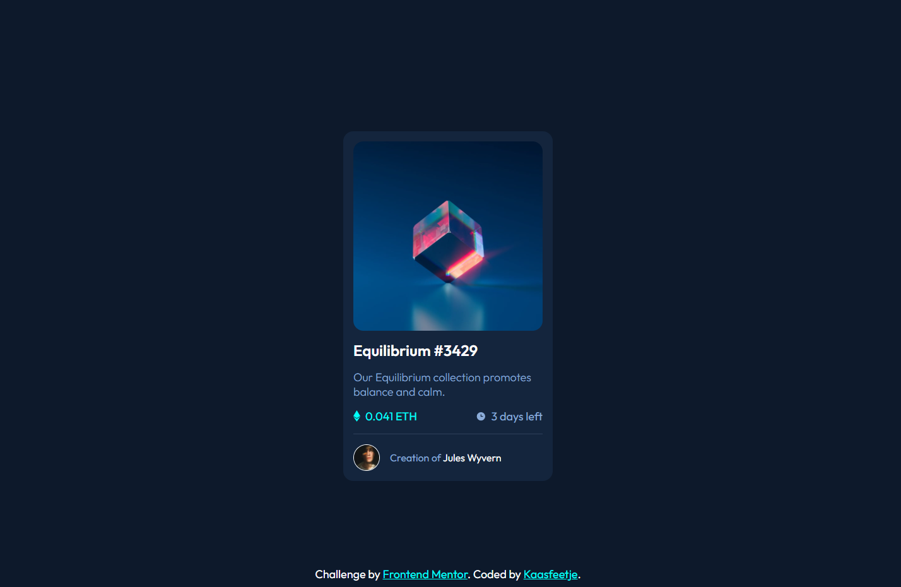
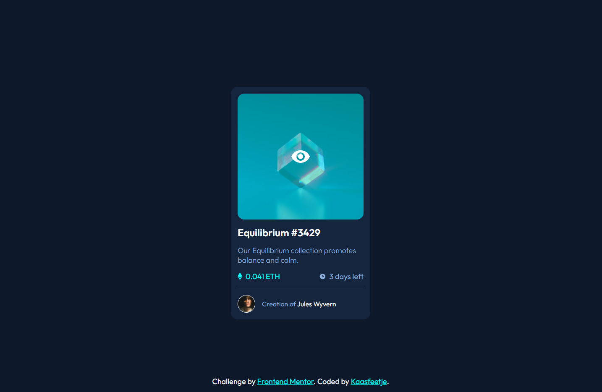
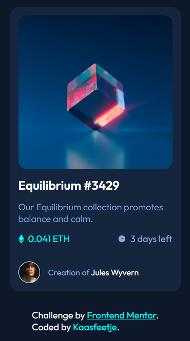
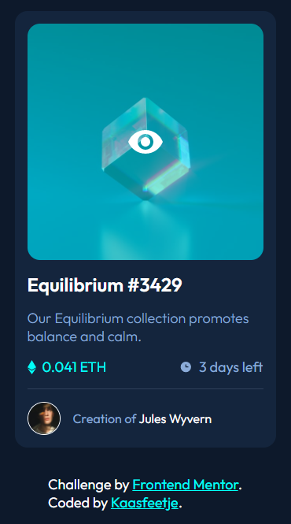

# Frontend Mentor - NFT preview card component solution

This is a solution to the [NFT preview card component challenge on Frontend Mentor](https://www.frontendmentor.io/challenges/nft-preview-card-component-SbdUL_w0U). Frontend Mentor challenges help you improve your coding skills by building realistic projects.

## Table of contents

-   [Overview](#overview)
    -   [The challenge](#the-challenge)
    -   [Screenshot](#screenshot)
    -   [Links](#links)
-   [My process](#my-process)
    -   [Built with](#built-with)
-   [Author](#author)

## Overview

### The challenge

Users should be able to:

-   View the optimal layout depending on their device's screen size
-   See hover states for interactive elements

### Screenshot

### Links

-   Solution URL: [Github](https://github.com/Kaasfeetje/Frontend-Mentor-NFT-preview-card)
-   Live Site URL: [Site](https://nft-preview-card-kaasfeetje.netlify.app/)

## My process

### Built with

-   HTML
-   CSS

## Author

-   Github - [Kaasfeetje](https://github.com/Kaasfeetje)
-   Frontend Mentor - [@Kaasfeetje](https://www.frontendmentor.io/profile/Kaasfeetje)
-   Twitter - [@veldhuisMax](https://www.twitter.com/veldhuisMax)
